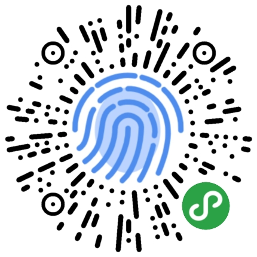
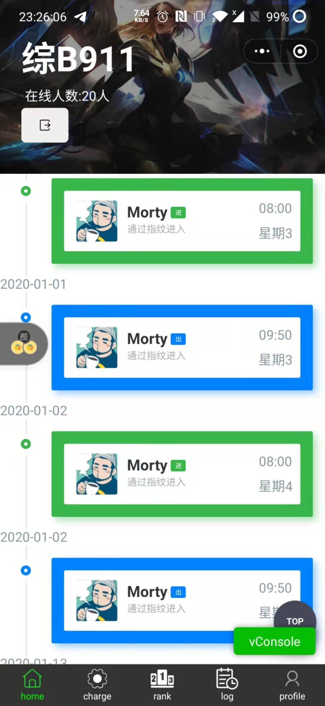
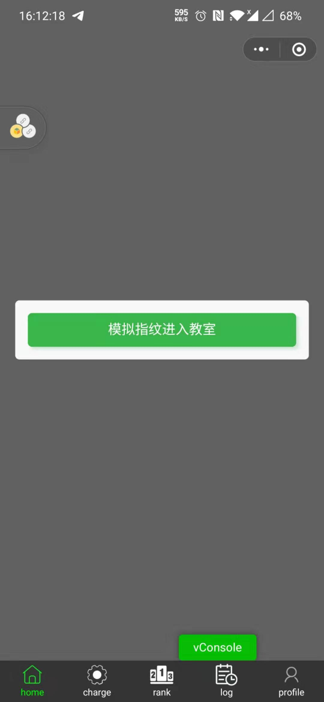
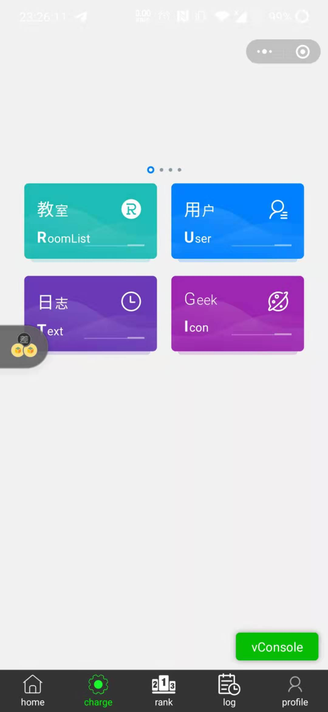
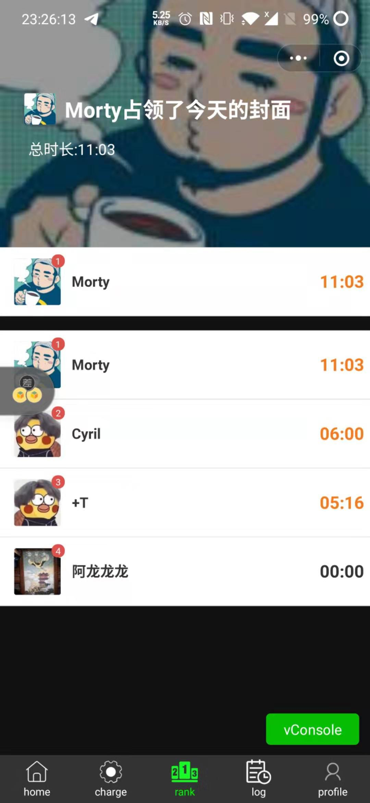
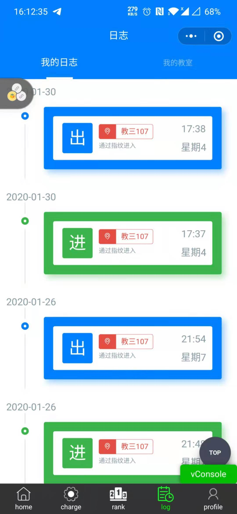
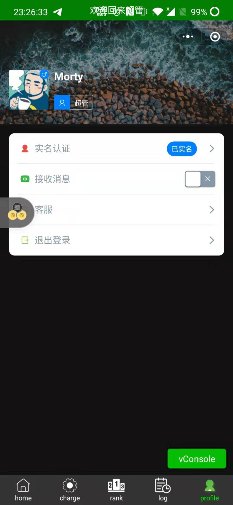
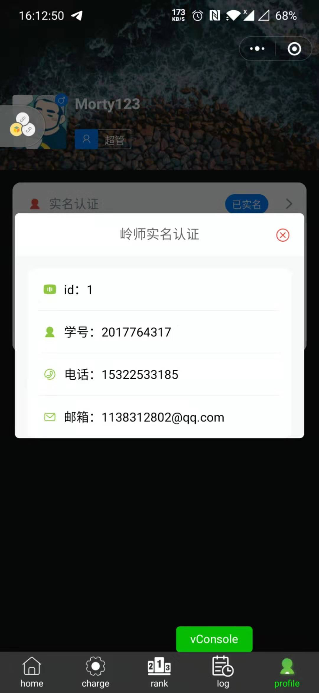

未完善

未完善

## 简介

这是一个结合线下的指纹出勤管理小程序

- **普通用户**：在线下通过指纹出入房间，然后在小程序能看到自己的日志记录，可以看到在每个教室的日志记录，时长，还有排行榜记录等等，在这之前要实名认证(一般用学号密码)。

- **管理员**：可以看到自己所管理的教室的日实时志，人数统计，发布公告等等。

- **超级管理员**：为管理员分配教室，对教室进行增删查改，查看全局日志等等

## 前端

前端使用的是Vue for uniapp(跨平台解决方案)，然后使用了许多组件，ColourUi，vant等等(前端页面后面再优化，作为一个后端狗尽力了:expressionless:) 

## 后端

采用**Springboot**它的好兄弟**Mybatis**作为后台，服务器是**Tomcat**，编辑器是**IDEA **，采用调用接口的形式接收前端传的值，然后返回json给前端

## todo

- 前端界面优化，逻辑优化
- 实现管理员功能

# 页面
## 主页

## 管理界面

  

## 排行榜

  

## 日志

  

## 个人信息

  

## 联系

QQ：1138312802

wechat：a1138312802

**Please feel free to contact me if you have any questions.:call_me_hand:**

